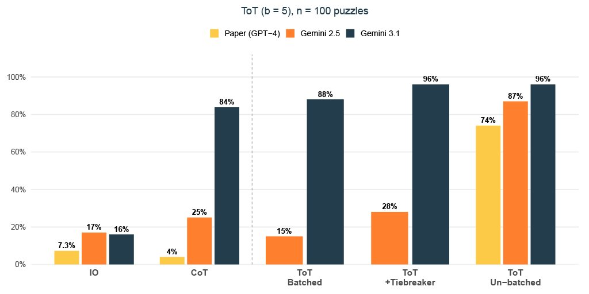
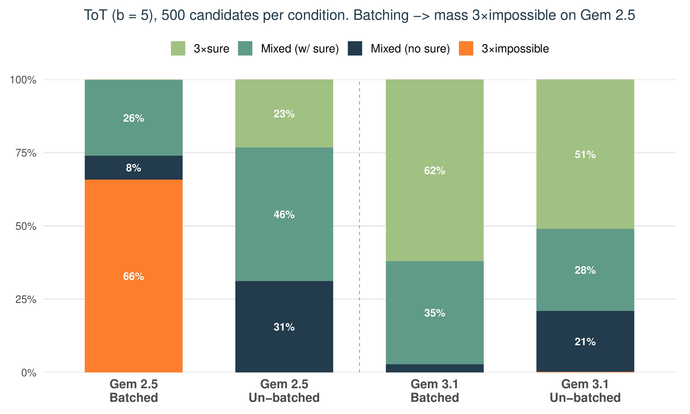
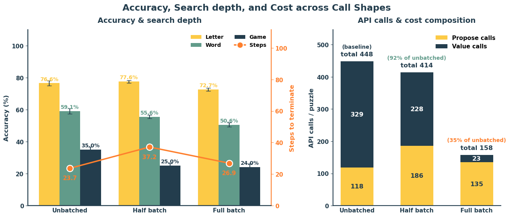
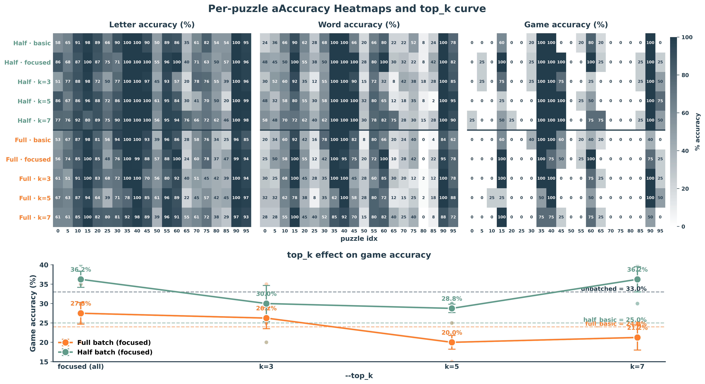
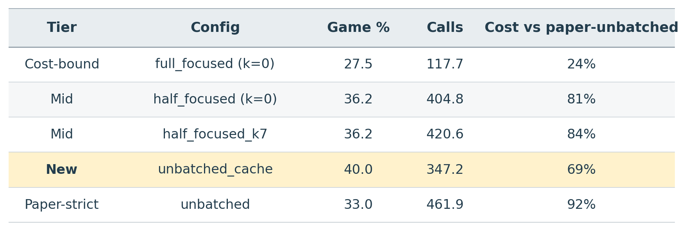
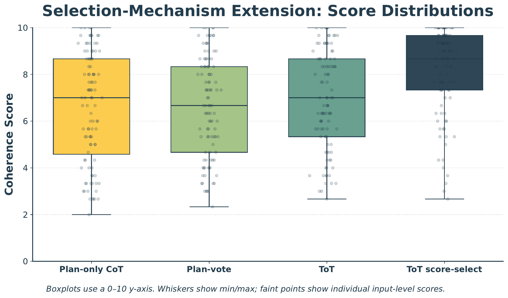
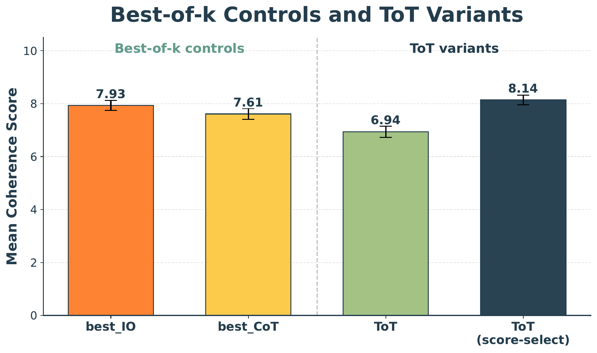

# Tree of Thoughts — Re-implementation & Extensions

A re-implementation of **Tree of Thoughts (ToT)** [Yao et al., NeurIPS 2023](https://arxiv.org/abs/2305.10601) with modern Gemini models, plus targeted extensions on the evaluator. Three tasks: **Game of 24** (BFS), **Mini Crosswords** (DFS + backtracking), and **Creative Writing** (plan/passage search with LLM-as-judge).

Built as a course project for CS 4782 (Cornell). Tested on **Gemini 3.1 Flash-Lite** (thinking), **Gemini 2.5 Flash-Lite** (non-thinking), and **Gemma 3 27B**.

---

## 1. Introduction

This repository is a re-implementation of *Tree of Thoughts: Deliberate Problem Solving with Large Language Models* (Yao et al., NeurIPS 2023). The original paper turns single-shot LLM reasoning into a search over intermediate "thoughts": the model proposes candidates, evaluates partial states via self-assessment, and explores with BFS or DFS. ToT's main contribution is showing that **explicit search + value-based pruning** can lift performance dramatically on tasks where one bad early step ruins the answer — most strikingly, raising Game of 24 accuracy from 7.3 % (IO) / 4 % (CoT) to **74 %** with ToT (b = 5) on GPT-4.

We reproduce the paper's three benchmark tasks on Gemini and extend the analysis along two axes the paper leaves unexplored:

1. **Evaluator design** — batched vs. unbatched prompting, focused candidate-level verdicts, gold-prompt re-verification, and a `(clue, constraint)` value cache for Crosswords.
2. **Selection mechanism** — vote-based ToT vs. independent scoring for Creative Writing.

---

## 2. Chosen Result

We targeted the original paper's headline numbers across all three tasks:

| Paper reference | Target | Paper (GPT-4) |
|-----------------|--------|--------------:|
| Table 2 | Game of 24, ToT (b = 5) success rate | **74 %** vs. IO 7.3 %, CoT 4 % |
| Table 3 | Mini Crosswords, ToT (DFS) — Letter / Word / Game | **78 / 60 / 20 %** |
| Figures 4–5 | Creative Writing, ToT vs. IO/CoT coherence | **ToT 7.56**, CoT 6.93, IO 6.19 |

These results collectively probe ToT under different search algorithms (BFS vs. DFS), thought granularities (equations vs. words vs. plans), and evaluator modes (value classification vs. voting), and demonstrate the framework's main claim: explicit search structure with LM-based evaluation outperforms single-path prompting on hard reasoning tasks.

---

## 3. GitHub Contents

```text
.
├── README.md, LICENSE, .gitignore
├── Tree of Thoughts.pdf            # Original paper (reference)
├── code/                           # All re-implementation source
│   ├── run.py                      # Unified CLI (24 / crosswords / text)
│   ├── analyze.py, rescore_24.py, reverify_24.py
│   ├── requirements.txt, conftest.py
│   ├── algorithms/                 # methods_24, methods_cw, methods_text
│   ├── core/model.py               # Async Gemini wrapper + rate limiter
│   ├── tasks/                      # State + I/O for each task
│   ├── prompts/                    # All prompt templates
│   ├── tests/                      # pytest unit tests
│   ├── scripts/{game24,crosswords,text}.sh + README.md
│   └── analysis/                   # Notebooks, scripts, figures, tables
├── data/                           # 24.csv, mini0505.json, text_inputs.json
├── results/                        # JSONL runs per task (+ logs, snapshots)
├── poster/Poster.pdf               # In-class poster
└── report/                         # Final report (PDF + .tex + .docx)
```


---

## 4. Re-implementation Details

**Models.** All three tasks run on Google Gemini through either AI Studio (free-tier) or Vertex AI (paid). Default: Gemini 3.1 Flash-Lite Preview (a "thinking" model, `thinking_level=MINIMAL` so the external ToT search drives reasoning, not internal CoT). Game of 24 ablations also cover Gemini 2.5 Flash-Lite (non-thinking) and Gemma 3 27B; Creative Writing uses Gemini 2.5 as generator with Gemini 3.1 as a fixed LLM-as-judge. **No fine-tuning** — all reasoning is prompt-driven at inference time.

**Datasets.**
- *Game of 24*: the original "100 hardest" subset (puzzles 901–1000) from `4nums.com`.
- *Mini Crosswords*: the paper's 20-puzzle subset (indices 0, 5, …, 95) from GooBix.
- *Creative Writing*: 100 four-sentence prompts (`data/text_inputs.json`).

**Tools.** Python 3.13, `google-genai` SDK, `asyncio` for concurrency, `tenacity` for retries, `sympy` for the Game of 24 verifier, `pytest`, `matplotlib` for analysis.

**Evaluation metrics.**
- *Game of 24*: exact symbolic verification (uses all four numbers once and evaluates to 24).
- *Mini Crosswords*: letter, word, and game accuracy averaged over up to 5 runs per config.
- *Creative Writing*: 1–10 LLM-as-judge coherence score (3 samples averaged).

**Key challenges / modifications.**
- The paper's per-state unbatched evaluator (~170 calls/puzzle for ToT b = 5) is implicit in the code, not the text. Our initial batched implementation silently degraded accuracy, motivating a systematic **batched vs. unbatched** comparison.
- For Crosswords we added a layered evaluator: `--batch {no, half, full}` × `{basic, focused, verified, cache}`, where *focused* asks for a single candidate-level verdict, *verified* re-confirms each kill via the gold prompt, and *cache* memoizes `(clue, constraint) → verdict` across siblings.
- For Game of 24, a zero-cost local-verifier tiebreaker re-picks the highest-scored *correct* depth-3 candidate from the existing trace; for Creative Writing, a `tot_score_select` variant replaces vote prompts with independent scoring.

---

## 5. Reproduction Steps

**Setup** (commands run from the repo root).

```bash
pip install -r code/requirements.txt
export GEMINI_API_KEY="your_key_here"        # or use --vertex with $GCP_PROJECT
mkdir -p data
curl -o data/24.csv       https://raw.githubusercontent.com/princeton-nlp/tree-of-thought-llm/master/src/tot/data/24/24.csv
curl -o data/mini0505.json https://raw.githubusercontent.com/princeton-nlp/tree-of-thought-llm/master/src/tot/data/crosswords/mini0505.json
pytest code/tests/                            # zero-API-cost sanity checks
```

**Quick start** — one config per task via the unified CLI:

```bash
# Game of 24 — ToT (b=5) unbatched evaluator (paper-strict)
python code/run.py --task 24 --method tot --b 5 --no_batch --n_puzzles 100

# Mini Crosswords — paper-strict unbatched ToT on the 20-puzzle paper split
python code/run.py --task crosswords --method tot --batch no --paper_split

# Mini Crosswords — unbatched + value cache
python code/run.py --task crosswords --method tot --batch no --cache --paper_split

# Creative Writing — ToT vote + LLM-as-judge
python code/run.py --task text --method tot --n_puzzles 100 \
    --vertex --model gemini-2.5-flash-lite --thinking_level NONE
```

Bulk experiment drivers (each tee'd to `results/logs/<name>.log`):

```bash
bash code/scripts/game24.sh
bash code/scripts/crosswords.sh
bash code/scripts/text.sh
```

Each script accepts env-var overrides (`N_PUZZLES`, `MODEL`, `RPM`, `VERTEX=1`, `OVERWRITE=1`, etc.) — see [`code/scripts/README.md`](code/scripts/README.md) for the full list. All runs auto-resume; rerun the same command after a daily rate-limit hit and missing puzzles will be appended to the existing JSONL.

**Compute & cost.** No GPU required — this is API-driven. Free-tier Gemini Flash-Lite caps at 15 RPM and 1 000 RPD; expect ~7 min for IO/CoT and ~2 h for ToT (b = 5) per 100-puzzle Game of 24 run. Total Vertex spend across all our experiments was approximately **$15**.

---

## 6. Results / Insights

### Game of 24 (Table from paper: 74 % on GPT-4)

100 hardest puzzles (901–1000). Per-state unbatched ToT (b = 5) **exceeds the paper** on both Gemini models:

| Method | Gemini 3.1 | Gemini 2.5 | Gemma 3 27B | Paper (GPT-4) |
| :--- | :---: | :---: | :---: | :---: |
| **IO** | 16 % | 17 % | 14 % | 7.3 % |
| **CoT** | 84 % | 29 % | 32 % | 4.0 % |
| **ToT (b = 1) batched** | 65 % | 11 % | 9 % | — |
| **ToT (b = 5) batched** | 88 % | 15 % | 14 % | — |
| **ToT (b = 5) batched + rescore** | 96 % | 28 % | 33 % | — |
| **ToT (b = 1) unbatched** | 83 % | 53 % | — | 45 % |
| **ToT (b = 5) unbatched** | **96 %** | **87 %** | — | **74 %** |

<p align="center">
  
  <br><em>Success rate on Game of 24 (n = 100, b = 5). Unbatched ToT on both Gemini models exceeds GPT-4's 74 %. Batching collapses Gemini 2.5; the zero-cost rescore tiebreaker recovers most of the gap on Gemini 3.1.</em>
</p>

*Reproduction.* Paper-strict unbatched ToT (b = 5) hits **96 % on Gemini 3.1, 87 % on Gemini 2.5, vs. paper's 74 % on GPT-4**, with the IO < CoT < ToT ordering preserved on Gemma 3 27B too. Gemini's stronger arithmetic recall even lifts the IO baseline from 7.3 % to 16–17 %. Full sweep cost ~\$8 of Vertex credit.

*Extension.* Batching the evaluator into one prompt **collapses Gemini 2.5** (87 → 15 %) but only mildly affects Gemini 3.1 (96 → 88 %): non-thinking models shift from absolute to competitive grading (66 % "impossible" verdicts vs. 0 % unbatched, see figure below). A zero-cost rescore — re-picking the highest-scored *correct* depth-3 candidate from the trace — fully recovers Gemini 3.1 but only partially recovers Gemini 2.5 (15 → 28 %): batching corrupts only the final selection on thinking models but the entire BFS trajectory on non-thinking ones.

<p align="center">
  
  <br><em>Evaluator verdict distribution at BFS depth 0. Batching causes Gemini 2.5 to vote "impossible" on 66 % of candidates (vs. 0 % unbatched). Gemini 3.1's thinking tokens resist: 62 % "sure" even when batched.</em>
</p>

### Mini Crosswords (Table 3 in paper: 78 / 60 / 20 %)

Paper split (20 puzzles, indices 0, 5, …, 95) on Gemini 3.1 Flash-Lite. Averaged over up to 5 runs.

| Configuration | Letter % | Word % | Game % (± SE) | API calls/puzzle | Steps |
| :--- | ---: | ---: | ---: | ---: | ---: |
| IO baseline | 45.4 | 18.3 | 0.0 | 10 | 1 |
| CoT baseline | 38.8 | 15.0 | 0.3 | 10 | 1 |
| ToT unbatched *(paper-strict)* | 77.4 | 59.1 | **33.0** ± 2.5 | 462 | 24.3 |
| → + best-state oracle | 80.0 | 61.3 | 33.0 | 462 | 24.3 |
| → − prune | 70.7 | 47.5 | 17.5 | 88 | 17.5 |
| → − backtrack | 39.3 | 23.5 | 5.0 | 26 | 3.6 |
| ToT full batch (basic) | 72.7 | 50.6 | 24.0 ± 2.4 | **158** | 26.9 |
| ToT half batch (basic) | 77.6 | 55.6 | 25.0 ± 1.6 | 414 | 37.2 |
| **ToT full + focused (k = 0)** | 74.8 | 54.0 | 27.5 ± 3.2 | 118 | 19.6 |
| **ToT half + focused (k = 7)** | 82.2 | 63.4 | 36.2 ± 3.8 | 421 | 29.6 |
| **ToT unbatched + cache** *(new  leader)* | 77.1 | 61.5 | **40.0 ± 4.1** | **347** | 27.0 |

Paper reference (GPT-4): IO 38.7 / 14.0 / 0.0 %, CoT 40.6 / 15.6 / 1.0 %, ToT 78.0 / 60.0 / 20.0 %.

*Reproduction.* The headline is **per-letter parity but nearly 2 × game accuracy** (33 vs. 20 % unbatched): Gemini closes whole grids the paper's GPT-4 search merely visited. Both paper-highlighted ablations reproduce — $-$backtrack collapses to 5 % game in 3.6 steps, $-$prune drops to 17.5 %. The one place we don't reproduce is the `+best-state` oracle gap (paper +15 pp, ours ≈ 0): Gemini's DFS commits cleanly to the gold grid rather than walking past it.

*Extension.* **Focused candidate-level verdicts** (one viable/not-viable judgment per sibling) dominate basic at both batch levels: `full_focused` 27.5 % / 118 calls, `half_focused_k7` 36.2 % / 421 calls (matches unbatched at lower cost). A one-line **`--cache` flag** is the **cheapest accuracy win in the study** — 40.0 % game / 347 calls / −23 % runtime, dominating paper-strict on both axes by regularizing noisy gold-prompt verdicts across siblings. **`--verified`** re-confirmation was the only extension that backfired: it regressed every focused config by un-killing candidates the search should have pruned.

<p align="center">
  
  <br><em>Call-shape comparison. Full batching cuts cost 65 % for an 11 pp game drop (35 % → 24 %); half batching holds the highest letter accuracy (77.6 %) but is dominated on game accuracy.</em>
</p>

<p align="center">
  
  <br><em>Focused evaluator: per-puzzle heatmaps (top) and top-K sweep on game accuracy (bottom). Focused dominates basic on both batch levels; <code>half_focused_k7</code> matches unbatched, full peaks at top-K=0.</em>
</p>

<p align="center">
  
  <br><em>Cost-vs-accuracy tier summary across the study. Unbatched + cache dominates the paper-strict configuration on both axes.</em>
</p>

Full per-config table and plots: [`results/crosswords/analysis.md`](results/crosswords/analysis.md), [`code/analysis/crosswords/plots/`](code/analysis/crosswords/plots/).

### Creative Writing (Paper Figures 4–5)

100 four-sentence prompts. Generator Gemini 2.5 Flash-Lite, judge Gemini 3.1 Flash-Lite Preview (1–10 coherence).

| Method | Mean ± SEM | Insight |
| :--- | :---: | :--- |
| IO | 6.63 ± 0.21 | Direct one-shot baseline. |
| CoT | 6.50 ± 0.22 | Plan + passage in one prompt. |
| Standard ToT | 6.94 ± 0.21 | Best of the vote-based baselines. |
| ToT + refine | **7.14** ± 0.21 | Best of the refined-baseline group. |
| best-of-k CoT | 7.61 ± 0.20 | k = 5 samples, independent score-select. |
| best-of-k IO | 7.93 ± 0.19 | Sampling beats voting. |
| **`tot_score_select`** | **8.14** ± 0.19 | Independent scoring instead of vote prompts. |

Paper reference (GPT-4 judge): ToT 7.56, CoT 6.93, IO 6.19.

*Reproduction.* Vote-based ToT helps (6.94 vs. IO 6.63, CoT 6.50), reproducing the paper's **ToT > CoT ≈ IO** ordering. Absolute scores aren't directly comparable (Gemini judge vs. paper's GPT-4); only relative ranking carries over, with compressed magnitudes — Gemini's strong one-shot baseline leaves less headroom. Refinement adds +0.2–0.3 pp on every method (ToT + Refine 7.14, the best of the refined group).

*Extension.* **Score-based selection consistently beats vote-based planning**: `tot_score_select` is the headline at 8.14, `best-of-k IO` reaches 7.93 with no tree at all, and `best-of-k CoT` reaches 7.61 — all above standard ToT's 6.94. The `plan_vote` / `plan_only_cot` controls (6.62, 6.57) isolate the mechanism: voting on plans without scoring passages barely lifts over IO. For open-ended tasks without an exact verifier, evaluator calibration matters more than search depth.

<p align="center">
  
  <br><em>Selection-mechanism ablations across plan-only CoT, plan-vote, standard ToT, and ToT score-select. Score-select concentrates scores near the top of the range; vote-based ToT has the widest spread.</em>
</p>

<p align="center">
  
  <br><em>Best-of-k controls vs. ToT variants. <code>best-of-k IO</code> (7.93) and <code>tot_score_select</code> (8.14) both outperform standard vote-based ToT (6.94).</em>
</p>

---

## 7. Conclusion

### Per-task paper reproduction

- **Game of 24 — reproduced and exceeded the paper.** Unbatched ToT (b = 5) hits **96 %** on Gemini 3.1 and **87 %** on Gemini 2.5, vs. the paper's **74 %** on GPT-4. The qualitative ordering (IO < CoT < ToT) is preserved on every model tested, and Gemma 3 27B reproduces the gap with smaller absolute values (14 → 33 %). The main reproduction lesson was that the paper's per-state evaluator pattern is implicit in the code, never stated in the text — our initial batched implementation silently degraded accuracy and revealed the batching-vs-unbatching axis as the central extension.
- **Mini Crosswords — reproduced per-letter, exceeded on game accuracy.** Unbatched ToT reaches **77.4 / 59.1 / 33.0 %** (letter/word/game) vs. the paper's **78.0 / 60.0 / 20.0 %** — essentially tied on per-cell quality but **nearly 2 × game accuracy**. Every ablation reproduces the paper's qualitative direction: `−backtrack` collapses to 5 % game, `−prune` drops 16 pp. The one place we *don't* reproduce the paper is the `+best-state` oracle gap (paper +15 pp, ours ≈ 0) — Gemini's DFS commits cleanly to the gold grid rather than walking past it.
- **Creative Writing — reproduced ranking, compressed magnitudes.** Standard ToT (6.94) ≥ IO (6.63) ≥ CoT (6.50) preserves the paper's `ToT > CoT > IO` ordering, but the gaps are smaller than the paper's (ToT 7.56 vs. CoT 6.93 vs. IO 6.19) — likely because Gemini's stronger one-shot generation leaves less room for search to help. Refinement adds a modest +0.2 pp on every method, confirming the paper's claim that post-generation revision is a general win.

### Constrained vs. open-ended: the unifying insight

ToT's value cleanly decomposes into a **search structure** (BFS / DFS with backtracking) and an **evaluation mechanism**, and which one dominates is task-type-dependent:

- **Constrained tasks (Game of 24, Crosswords)** are *search-bound*. Backtracking is the engine — without it accuracy collapses 30+ pp on both tasks. Pruning matters but is recoverable. Evaluator design moves accuracy ~5–10 pp; *search structure* moves it 30+ pp.
- **Open-ended tasks (Creative Writing)** are *evaluator-bound*. The tree structure helps modestly (ToT 6.94 vs. IO 6.63), but **independent score-selection improves much more** — `tot_score_select` 8.14, even `best-of-k IO` 7.93 with no tree at all. When there is no exact verifier, the bottleneck is whether you can reliably *rank* candidates, not how many you generate or how deeply you search.

<!-- A second cross-task pattern: **batching corrupts evaluation more on non-thinking models** than on thinking ones. Gemini 2.5 drops 87 → 15 % when ToT's value evaluator is batched on Game of 24; Gemini 3.1 drops only 96 → 88 %. On Crosswords the same effect appears as full-batch losing 11 pp on game accuracy. The mechanism is shared: multi-candidate prompts shift the model from absolute judgment ("is this state likely?") to competitive ranking ("which of these is best?"), and only thinking tokens resist that shift. -->

### Future work

- **Crosswords:** combine `--focused` candidate-level verdicts with the `--cache`, which we did not fully test. The cache regularizes evaluator noise (the main mechanism behind its +7 pp gain), and focused is independently dominant — together they could push above the current 40 % game leader at lower cost.
- **Game of 24:** train a small, fine-tuned evaluator (e.g., distill from unbatched Gemini 3.1 traces) to recover unbatched accuracy at batched-level cost. This is the only avenue we see for closing the 3–4 × cost gap of paper-strict ToT.
- **Creative Writing:** the `tot_score_select` win suggests every vote-based ToT prompt in the original code base is replaceable with independent scoring. A systematic sweep — vote vs. score across multiple judges and tasks — would test whether the result generalizes.
- **Across tasks:** ToT's `(generator, evaluator)` decomposition begs for a unified meta-controller that picks evaluator mode (batched / focused / cache / score-select) from task characteristics (verifier availability, candidate fan-out, value-prompt cost). Our results suggest a 2 × 2 rule: *verifiable + cheap evaluator* → batched, *verifiable + expensive evaluator* → focused + cache, *open-ended + cheap judge* → score-select, *open-ended + expensive judge* → best-of-k with refinement.

---

## 8. References

1. S. Yao et al., *Tree of Thoughts: Deliberate Problem Solving with Large Language Models*, NeurIPS 2023.
2. J. Wei et al., *Chain-of-Thought Prompting Elicits Reasoning in Large Language Models*, NeurIPS 2022.
3. Z. Cheng et al., *Batch Prompting: Efficient Inference with LLM APIs*, EMNLP Industry Track 2023.
4. J. Lin et al., *BatchPrompt: Accomplish More with Less*, ICLR 2024.
5. M. Lee, P. Liang, Q. Yang, *CoAuthor: Designing a Human-AI Collaborative Writing Dataset*, CHI 2022.
6. ToT reference code — <https://github.com/princeton-nlp/tree-of-thought-llm>
7. Puzzle data — 4nums.com (Game of 24), GooBix (Mini Crosswords).
8. Google Cloud Vertex AI — Gemini 2.5 Flash-Lite, Gemini 3.1 Flash-Lite Preview.
9. SymPy — symbolic mathematics library for Python.

---

## 9. Acknowledgements

This work was completed as the final project for **CS 4782/5782: Introduction to Deep Learning (Cornell, Spring 2026)**, taught by **Profs. Killian Weinberger and Wei-Chiu Ma**. We thank the course staff for feedback during the proposal and poster sessions, and Princeton NLP for releasing the original ToT reference implementation and data splits.

**Team 78:** Minghan Gao (mg2328), Warren Hua (wsh48), Zhichun Zhang (zz547), Yihan Zhao (yz2788).